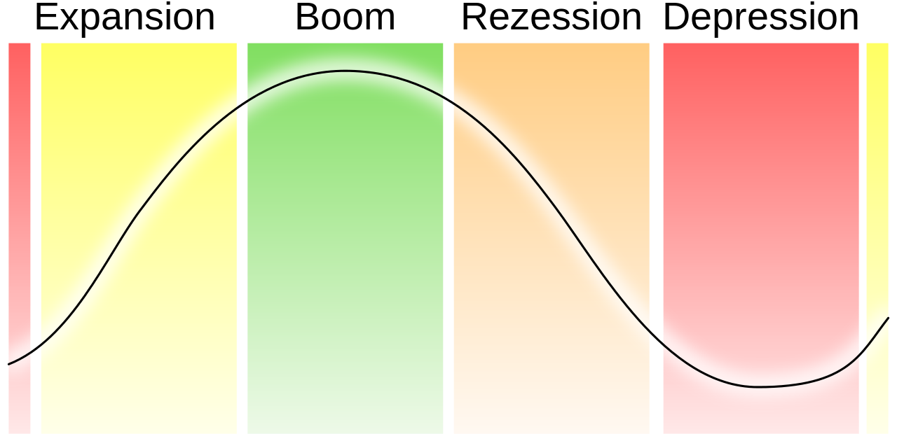

Grundzüge staatlicher Wirtschaftspolitik

# Grundzüge staatlicher Wirtschaftspolitik

## Formen

- Planwirtschaft: Wirtschaft wird von Staat geplant (z.B. in sozialistischen Staaten)
- Soziale Marktwirtschaft: Staat greift ein, um soziale Gesichtspunkte zu kontrollieren (z.B. Deutschland)
- Freie Marktwirtschaft: Staat greift nicht in die Wirtschaft ein

## Magisches Viereck (/Sechseck)

Stabilitäts und Wachstumsgesetz:
§1 : Gesamtwirtschaftliches Gleichgewicht (alle Produktionsfaktoren sind voll beschäftigt und alle Märkte gleichen sich aus)

Grundpfeiler des magischen Vierecks (Staatliche Interessen):

Qualitative Ziele:
- Außenwirtschaftliches Gleichgewicht: Wird gemessen am Außenhandelssaldo. 1-2 % des Pruttosozialprodukts sind ideal (Deutschland 2018: 6,8%)
- Stetiges und angemessenes Wirtschaftswachstum: Gemessen am Bruttinlandsprodukt (Wert aller Waren und Dienstleistungen, die in einem Jahr innerhalb der Landesgrenzen einer Volkswirtschaft produziert werden). (Deutschland 2018: 3.300 Mrd. €)
- Hoher Beschäftigungsstand: Gemessen an der Arbeitslosenquote (Deutschland April 2018: 4,9%)
- Preisniveaustabilität: Gemessen an der Inflationsrate (Deutschland April 2018: 2,0%)

Quantitative Ziele:

- Gerechte Einkommens- und Vermögensverteilung
- Umweltschutz

## Kunjunktur

Die Kunjunktur ist die gesamtwirtschaftliche Lage. Es gibt verschiedene Phasen:

Instgesamzt ist ein Aufschwung der wirtschaftlichen Lage mit den Phasen zu beobachten.

| | Aufschwung (Expansion) | Boom | Abschwung (Rezession) | Depression |
| - | - | - | - | - |
| Beschäftigung | Steigend | Stabil am höchsten | Sinkend | Stabil am niedrigsten |
| Auftragseingang | Steigend | Stabil am höchsten | Sinkend | Stabil am niedrigsten |
| Zinsniveau | Steigend | Stabil am höchsten | Sinkend | Stabil am niedrigsten |
| Konsumneigung | Steigend | Stabil am höchsten | Sinkend | Stabil am niedrigsten |

### Konjunkturindikatoren

#### Frühindikator

- Auftragseingänge bei Unternehmen
- Kreditzusagen
- Investitionsvolumen
- Geschäftserwartung von Unternehmen
- Baugenehmigungen im Hochbau

#### Präsenzindikator (gleichlaufende Indikatoren)

- Veränderung des BIP
- Ausmaß Kurzarbeit
- Investitionsvolumen
- Kapazitätsauslastung
- Produktionsindizes

#### Spätindikatoren

- Arbeitslosenquote
- Ausmaß Kurzarbeit
- Preisundizes

### Ifo-Geschäftsklimaindex